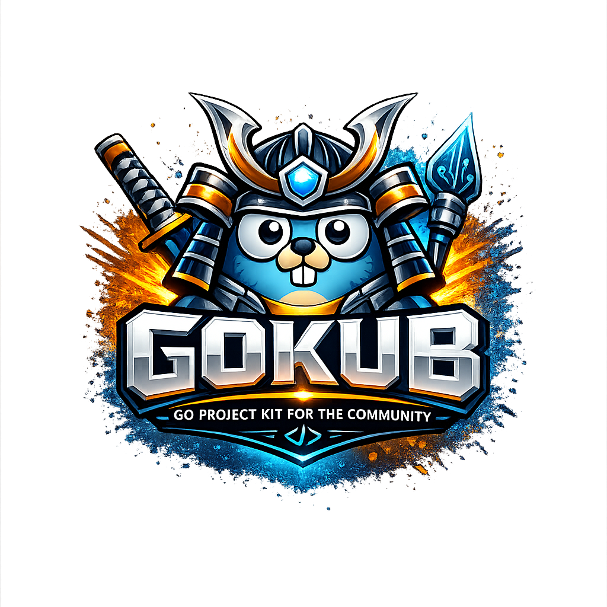

<p align="center">
  
</p>

<h1 align="center">GOKUB</h1>

<p align="center">
  <strong>Ship a production-ready Go service in one command.</strong><br>
  A guided generator that scaffolds clean, domain-focused services you fully own —
  no framework lock-in, no boilerplate, batteries included.
</p>

<p align="center">
  <a href="https://github.com/ongyoo/gokub/actions/workflows/ci.yml"></a>
  <a href="https://github.com/ongyoo/gokub/releases/latest"></a>
  <a href="LICENSE"></a>
  
  
</p>

---

Pick an HTTP framework, database, and messaging provider; GOKUB generates ordinary
Go code in a consistent, production layout:

```text
cmd/<name>-service/   entrypoint · graceful shutdown
config/               environment configuration (envconfig · .env)
internal/<domain>/    model · repository · service · handler · router
internal/app/         composition · event bus (rabbitmq | kafka | nats)
pkg/                  api · crypto · database (gorm) · error · httpserver
                      middleware · utils · validator
```

## ✨ Features

| | |
|---|---|
| 🧩 **Framework choice** | Generate for **Gin**, **Fiber**, or **Echo** — only the chosen one, no dead code |
| 🗄️ **gorm + PostgreSQL** | Repository/service/handler/router per domain, ready to extend |
| ✅ **Validated requests** | `go-playground/validator` tags, rejected with 400 before your service runs |
| 🔐 **Encryption built in** | AES-256-GCM helpers + a `Secret` column type that encrypts values at rest |
| 📨 **Real messaging** | RabbitMQ / Kafka / NATS publishers, swappable with `enable` · `switch` · `disable` |
| 🛡️ **Hardened HTTP** | Timeouts, graceful shutdown, request-id, CORS, secure headers, panic recovery |
| ❤️ **Health probes** | `/health/live` and a `/health/ready` that pings the database |
| 🤖 **AI-native** | Choose Codex / Claude / Copilot / Gemini guidance at create time; MCP server included |
| 🧪 **Quality gates** | `gofmt`, `go vet`, `staticcheck`, `golangci-lint`, race tests — all green out of the box |

## 📦 Install

macOS and Linux, Intel and ARM:

```bash
/bin/bash -c "$(curl -fsSL https://raw.githubusercontent.com/ongyoo/gokub/main/install.sh)"
```

Or your package manager of choice:

```bash
brew install ongyoo/tap/gokub                      # Homebrew
go install github.com/ongyoo/gokub/cmd/gokub@latest # Go
```

```bash
gokub version   # verify
```

## 🚀 Quick start

```bash
gokub new
```

Arrow keys to move, **Enter** to accept the recommended value. Eight focused
questions — nothing that doesn't change the output:

```text
Project name      example-api
Go module         github.com/example/example-api
Go version        1.26 (recommended)
Framework         gin | fiber | echo
Database          postgres
Messaging         none
Vibe coding       all        ← AI assistants: all | codex | claude | copilot | gemini | none
Recipe            none
```

When it finishes, GOKUB steps into the project and opens an in-project command
center. Run it:

```bash
cd example-api
docker compose up -d postgres
make run        # or: go run ./cmd/example-api-service
```

A ready-to-run, git-ignored `.env` (with a unique encryption key) is already there.

## 🧱 What every project ships

- **Domain module** — `model`, `repository`, `service` (interface + mockgen), `handler`
  (exported methods + swagger godoc), `router` (`SetRoutes` with group middleware)
- **Server** — read/write/idle timeouts and signal-based graceful shutdown
- **Middleware** — request-id, CORS, secure headers, panic recovery, structured logging (logrus)
- **Config** — `envconfig` + `godotenv`, so `.env` just works locally
- **Security** — `pkg/crypto` (AES-256-GCM) and an encrypted `Secret` gorm column
- **Ops** — Dockerfile, docker-compose, GitHub Actions CI, `.golangci.yml` + `make lint`
- **DX** — VS Code & JetBrains run/debug configs, agent guidance, `.mcp.json`

## ⚡ Everyday workflows

Run `gokub` inside a project for the command center, or use commands directly:

| Goal | Command |
|---|---|
| Add GOKUB + AI skills to an existing Go project | `gokub init` |
| Add a CRUD domain | `gokub add crud product` |
| Add a custom named module | `gokub add custom orders` |
| Generate a model from a file | `gokub add model user --from user.json` |
| Generate a model from inline JSON | `gokub add model user --json '{"id":1,"name":"Ada"}'` |
| Add authentication | `gokub add auth` |
| Enable / switch messaging | `gokub enable messaging kafka` · `gokub switch messaging rabbitmq` |
| Add AI assistant guidance later | `gokub agent init --provider claude` |
| Project state & health | `gokub status` · `gokub doctor` |
| Quality gate & architecture | `gokub score --fail-under 80` · `gokub graph --check` |

```bash
gokub help          # discover everything
gokub help new
```

## 🤖 Built for developers and AI

Every project can carry shared context for humans and coding agents:

- `gokub.init` marks the repository as initialized; `.gokub.yaml` records detected project context
- `AGENTS.md`, `CLAUDE.md`, Gemini and GitHub Copilot instructions
- Portable skills for Codex, Claude, Copilot, Gemini
- `.codex/config.toml` and `.mcp.json`; `gokub mcp serve` exposes typed tools
- Machine-readable `status`, `doctor`, `score`, and `graph --format json`

```bash
cd your-existing-go-project
gokub init                 # detects go.mod and installs all agent skills safely
gokub mcp serve
```

`gokub init` preserves existing source and agent instruction files. Use detection
overrides such as `--framework gin` or `--database postgres` only when needed.

VS Code extension (from the latest release):

```bash
curl -fL https://github.com/ongyoo/gokub/releases/latest/download/gokub-vscode.vsix -o gokub-vscode.vsix
code --install-extension gokub-vscode.vsix
```

## 🛠️ Automation

Every choice is scriptable for CI and repeatable setups:

```bash
gokub new payments \
  --module github.com/example/payments \
  --framework fiber \
  --database postgres \
  --messaging rabbitmq \
  --agents claude \
  --go-version 1.26
```

JSON output for pipelines and agents:

```bash
gokub status --json
gokub doctor --json
gokub score --json
gokub graph --format json
```

## 🔄 Update & uninstall

```bash
gokub update --check
gokub update
gokub uninstall
```

Homebrew installs use `brew upgrade gokub` / `brew uninstall gokub`.

## 📚 Documentation

| Guide | What you will find |
|---|---|
| [Getting started](docs/getting-started.md) | Installation, project creation, first run |
| [CLI reference](docs/cli-reference.md) | Commands, features, capabilities, recipes |
| [Project templates](docs/project-templates.md) | Layout and defaults |
| [Go version policy](docs/go-versions.md) | Recommended, conservative, custom |
| [Custom templates](docs/custom-templates.md) | Turn a folder into a reusable template |
| [JSON model generator](docs/json-model-generator.md) | Typed Go models from JSON or JSON Schema |
| [AI and IDE integrations](docs/integrations.md) | Codex, Claude, Copilot, MCP, VS Code, JetBrains |
| [Full documentation](docs/README.md) | Upgrades, plugins, skills, development, releases |

## 💻 Platform support

| Platform | Intel | ARM |
|---|:---:|:---:|
| macOS | ✅ | ✅ |
| Linux | ✅ | ✅ |

---

<p align="center">
  GOKUB is <a href="LICENSE">MIT licensed</a>. Templates, plugins, recipes, and skill packs welcome.<br>
  Powered by <a href="https://www.roomkub.com"><strong>Roomkub</strong></a>
</p>
